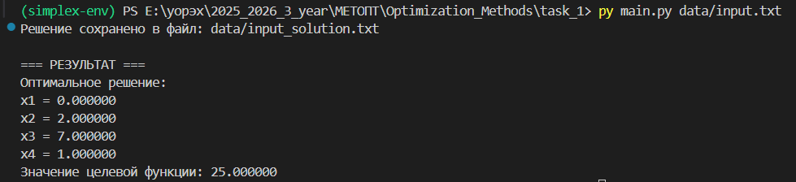
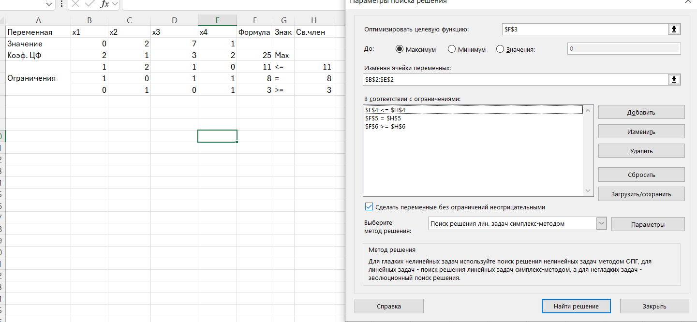

# Решение задачи линейного программирования симплекс-методом

## Ф.И.О.

Христофоров Владислав Николаевич

## Поток

МЕТОПТ 1.2

## Краткое описание алгоритма решения ЗЛП

### Общая схема алгоритма:

```
1. ЧТЕНИЕ ИСХОДНЫХ ДАННЫХ

2. ПРЕОБРАЗОВАНИЕ К КАНОНИЧЕСКОЙ ФОРМЕ
   - Приведение целевой функции к минимуму
   - Замена неравенств равенствами (фиктивные переменные)
   - Замена свободных переменных (x = x⁺ - x⁻)

3. РЕШЕНИЕ ВСПОМОГАТЕЛЬНОЙ ЗАДАЧИ
   - Добавление вспомогательных переменных
   - Решение симплекс-методом
   - Проверка существования допустимого решения

4. РЕШЕНИЕ ОСНОВНОЙ ЗАДАЧИ
   - Замена целевой функции на исходную
   - Решение симплекс-методом

5. ВОЗВРАТ К ИСХОДНЫМ ПЕРЕМЕННЫМ
   - Преобразование решения канонической формы
   - Вывод результата
```

### Псевдокод симплекс-метода:

```
ФУНКЦИЯ СимплексМетод(задача, является_вспомогательной)
    таблица = ПостроитьСимплексТаблицу(задача)

    ПОКА есть_отрицательные_коэффициенты В целевой_строке:
        столбец = найти_разрешающий_столбец()
        строка = найти_разрешающую_строку()

        ВЫПОЛНИТЬ шаг_симплекс_метода(строка, столбец)

        ЕСЛИ является_вспомогательной:
            удалить_столбцы_вспомогательных_переменных()

    ВЕРНУТЬ решение
КОНЕЦ ФУНКЦИИ
```

### Детальный алгоритм шага симплекс-метода:

```
ШАГ СИМПЛЕКС-МЕТОДА(разрешающая_строка, разрешающий_столбец):
    разрешающий_элемент = таблица[строка, столбец]

    // 1. Нормализация разрешающей строки
    ДЛЯ каждого j ОТ 0 ДО количество_столбцов:
        таблица[строка, j] = таблица[строка, j] / разрешающий_элемент

    // 2. Исключение переменной из других строк
    ДЛЯ каждого i ОТ 0 ДО количество_строк:
        ЕСЛИ i ≠ строка:
            множитель = таблица[i, столбец]
            ДЛЯ каждого j ОТ 0 ДО количество_столбцов:
                таблица[i, j] = таблица[i, j] - множитель * таблица[строка, j]

    // 3. Обновление базиса
    обменять_базисную_и_свободную_переменную(строка, столбец)
КОНЕЦ ШАГА
```

## Инструкция - как развернуть и запустить программу

### Требования к системе:

-   Python 3.8 или выше
-   Установленная библиотека numpy

### Установка зависимостей:

```bash
pip install numpy
```

### Структура проекта:

```
linear_programming_solver/
├── src/
│   ├── __init__.py
│   ├── problem.py           # Классы задач ЛП
│   ├── converter.py         # Преобразование в каноническую форму
│   ├── simplex_table.py     # Симплекс-таблица и алгоритм
│   ├── solver.py           # Основной решатель
│   └── auxiliary.py        # Вспомогательная задача
├── data/
│   ├── input1.txt          # Пример 1: все переменные любые
│   ├── input2.txt          # Пример 2: все переменные неотрицательные
│   └── input3.txt          # Пример 3: часть переменных неотрицательные
├── main.py                 # Точка входа
└── README.md              # Документация
```

### Формат входных файлов:

**Пример:**

```
max 2 3 1 4
1 1 1 1 <= 10
2 1 -1 1 = 8
0 1 2 1 >= 5
var 1 2 3 4 >= 0
```

### Запуск программы:

```bash
# Запуск с примером 1
python main.py data/input.txt
```

### Выходные данные:

Программа создает файл `[имя_входного_файла]_solution.txt` с подробным решением, включая:

-   Исходную задачу
-   Каноническую форму
-   Все шаги симплекс-метода
-   Оптимальное решение
-   Значение целевой функции

## Демонстрация работы программы

### Пример работы с задачей:

**Исходная задача:**

```
max 2 1 3 2
1 2 1 0 <= 11
1 0 1 1 = 8
0 1 0 1 >= 3
var 1 2 3 4 >= 0
```

**Результат выполнения:**

```
=== РЕШЕНИЕ ЗАДАЧИ ЛИНЕЙНОГО ПРОГРАММИРОВАНИЯ ===

=== ИСХОДНАЯ ЗАДАЧА ===
Целевая функция: max 2.0*x1 + 1.0*x2 + 3.0*x3 + 2.0*x4
Ограничения:
1.0*x1 + 2.0*x2 + 1.0*x3 + 0.0*x4 <= 11.0
1.0*x1 + 0.0*x2 + 1.0*x3 + 1.0*x4 = 8.0
0.0*x1 + 1.0*x2 + 0.0*x3 + 1.0*x4 >= 3.0
Неотрицательные переменные: x1, x2, x3, x4

=== КАНОНИЧЕСКАЯ ФОРМА ===
Каноническая форма:
Целевая функция: min -2.00*x1 + -1.00*x2 + -3.00*x3 + -2.00*x4
Ограничения:
1.00*x1 + 2.00*x2 + 1.00*x3 + 1.00*s1 = 11.00
1.00*x1 + 1.00*x3 + 1.00*x4 = 8.00
1.00*x2 + 1.00*x4 + -1.00*s2 = 3.00

=== РЕЗУЛЬТАТ ===
Оптимальное решение:
x1 = 0.000000
x2 = 2.000000
x3 = 7.000000
x4 = 1.000000
Значение целевой функции: 25.000000
```

### Скриншоты работы:





### Анализ результатов:

Программа успешно решает задачу линейного программирования, корректно обрабатывая:

-   Различные типы ограничений (≤, =, ≥)
-   Свободные и неотрицательные переменные
-   Случаи отсутствия допустимых решений
-   Неограниченные целевые функции

## Рефлективный вывод

### Полученный опыт и знания:

**Полезные аспекты работы:**

1. **Понимание симплекс-метода**: Реализация алгоритма с нуля позволила понять не только теоретические основы, но и практические нюансы работы метода.
2. **Опыт работы с численными методами**: Приобретены навыки работы с матрицами, системами линейных уравнений и методами оптимизации.
3. **Разработка математического ПО**: Получен опыт создания программного обеспечения для решения математических задач.

### Преодоленные трудности:

1. **Корректная реализация шага симплекс-метода**:

    - Проблема: Неправильный пересчет элементов таблицы
    - Решение: Изучение математических формул и их исправление в коде

2. **Обработка свободных переменных**:

    - Проблема: Неправильная замена x = x⁺ - x⁻
    - Решение: Переписывание алгоритма преобразования

3. **Удаление столбцов во вспомогательной задаче**:

    - Проблема: Неправильное удаление столбцов
    - Решение: Корректировка кода

4. **Замена целевой функции**:
    - Проблема: Неправильный переход от вспомогательной к основной задаче
    - Решение: Реализация корректного метода замены целевой функции в существующей таблице

### Выводы:

Работа над заданием позволила не только реализовать алгоритм симплекс-метода, но и глубоко понять его математические основы. В результате:

-   Создан решатель задач линейного программирования
-   Освоены принципы работы с симплекс-таблицами
-   Получен опыт обработки различных типов математических задач
-   Развиты навыки отладки сложных алгоритмов

Наиболее ценным оказалось понимание того, как теоретические математические концепции преобразуются в практические алгоритмы, и как важно учитывать все особые случаи при реализации численных методов.
