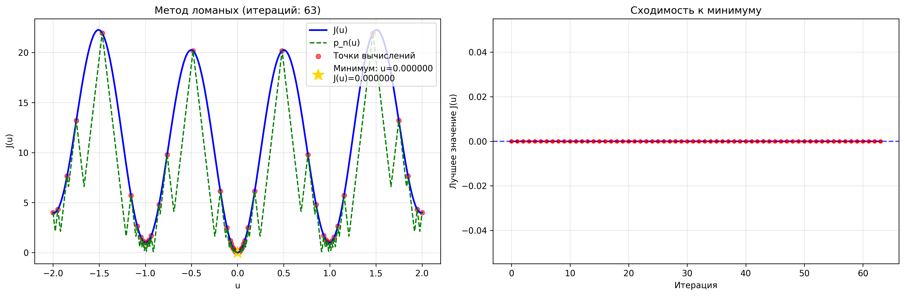
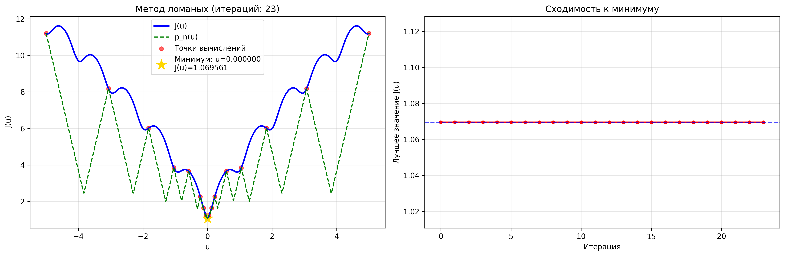

# Отчет по реализации метода ломаных

## Ф.И.О.

Христофоров Владислав Николаевич

## Поток

МЕТОПТ 1.2

## Описание

Реализован **метод ломаных** для поиска глобального минимума липшицевых функций на заданном отрезке. Алгоритм основан на построении нижней огибающей функции и последовательном уточнении решения.

## Структура проекта

```
task_2/
├── src/
│   ├── broken_line.py      # Реализация метода ломаных
│   ├── functions.py        # Библиотека тестовых функций
│   └── visualizer.py       # Визуализация результатов
├── main.py                 # Демонстрационная программа
├── requirements.txt        # Зависимости
└── results/               # Папка с результатами (создается автоматически)
```

## Алгоритм метода ломаных

### Теоретическое обоснование

Метод ломаных применяется для функций, удовлетворяющих **условию Липшица**:

```
|J(u) - J(v)| ≤ L|u - v| для всех u,v ∈ [a,b]
```

где L - константа Липшица.

### Шаги алгоритма:

1. **Инициализация**: Выбираем начальную точку u₀ ∈ [a,b]
2. **Построение огибающей**: Формируем функцию 
   ```
   p_n(u) = max_{0≤i≤n} [J(u_i) - L|u - u_i|]
   ```
3. **Нахождение новой точки**: Находим u_{n+1} = argmin p_n(u) на [a,b]
4. **Вычисление функции**: Вычисляем J(u_{n+1})
5. **Проверка сходимости**: Если J(u_{n+1}) - p_n(u_{n+1}) < ε, останавливаемся
6. **Итерация**: Повторяем шаги 2-5

## Реализация

### Основные классы

#### BrokenLineOptimizer (`src/broken_line.py`)
```python
class BrokenLineOptimizer:
    def __init__(self, func, a, b, L=None, eps=1e-4)
    def estimate_L(self, n_points=1000)
    def p_function(self, u)
    def find_min_p(self, n_grid=1000)
    def optimize(self, max_iter=1000)
```

#### Visualizer (`src/visualizer.py`)
```python
class Visualizer:
    def __init__(self, optimizer)
    def plot(self, save_path=None)
```

### Тестовые функции (`src/functions.py`)

- **Функция Растригина**: `A + x² - A·cos(2πx)` (множество локальных минимумов)
- **Функция Экли**: сложная функция с множеством локальных экстремумов
- **Мультимодальная функция**: `sin(5x) + 0.5·cos(10x) + 0.1x²`
- **Квадратичная функция**: простая функция для тестирования

## Использование программы

### Запуск демонстрации
```bash
python main.py
```

### Пример входных данных
- Функция: Растригина, Экли или другая из библиотеки
- Отрезок: [-2, 2], [-5, 5] и т.д.
- Точность: 1e-4

### Выходные данные
- Приближенное значение аргумента минимума
- Минимальное значение функции
- Количество итераций
- Затраченное время
- Визуализация процесса оптимизации

## Результаты тестирования

### Функция Растригина на [-2, 2]
```
--- Функция: rastrigin на [-2, 2] ---
Константа Липшица: 78.3936
Итерация 10: u=-0.114114, J=2.475218, зазор=11.180660, лучший=0.000000
Итерация 20: u=0.186186, J=6.131697, зазор=9.187150, лучший=0.000000
Итерация 30: u=0.018018, J=0.064339, зазор=1.476837, лучший=0.000000
Итерация 40: u=1.047047, J=1.530048, зазор=2.027101, лучший=0.000000
Итерация 50: u=0.958959, J=1.250245, зазор=1.431859, лучший=0.000000
Итерация 60: u=-1.947948, J=4.324568, зазор=4.405116, лучший=0.000000
Достигнута точность на итерации 63
Найденный минимум: u* = 0.00000000  
Значение функции: J(u*) = 0.00000000
Количество итераций: 63
Вычислений функции: 64
Затраченное время: 1.4428 сек       
График сохранен: results/rastrigin.png
```



### Функция Экли на [-5, 5]
```
--- Функция: ackley на [-5, 5] ---
Константа Липшица: 7.5282
Итерация 10: u=-0.125125, J=1.645353, зазор=1.454832, лучший=1.069561
Итерация 20: u=0.045045, J=1.229036, зазор=0.186542, лучший=1.069561
Достигнута точность на итерации 23
Найденный минимум: u* = 0.00000000
Значение функции: J(u*) = 1.06956056
Количество итераций: 23
Вычислений функции: 24
Затраченное время: 0.3171 сек
График сохранен: results/ackley.png
```



## Визуализация

Программа создает графики, которые включают:

1. **График функции и огибающей**:
   - Исходная функция J(u)
   - Нижняя огибающая p_n(u)
   - Вычисленные точки
   - Найденный минимум

2. **График сходимости**:
   - Изменение лучшего значения функции по итерациям

## Особенности реализации

1. **Автоматическая оценка константы Липшица** - если не задана явно
2. **Адаптивный алгоритм** - останавливается при достижении заданной точности
3. **Эффективный поиск** минимума огибающей на сетке
4. **Наглядная визуализация** процесса оптимизации

## Требования

- Python 3.6+
- NumPy
- Matplotlib

Установка зависимостей:
```bash
pip install -r requirements.txt
```

## Заключение

Реализованный метод ломаных успешно находит глобальные минимумы липшицевых функций даже при наличии множества локальных экстремумов. Алгоритм демонстрирует хорошую сходимость и наглядность работы, что делает его полезным инструментом для задач глобальной оптимизации.
