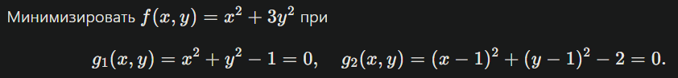
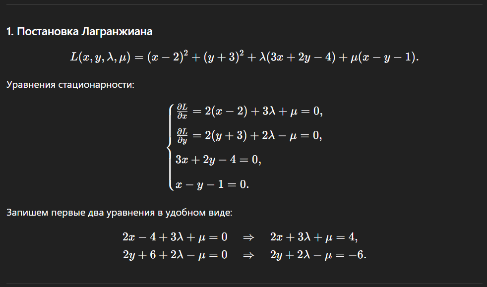
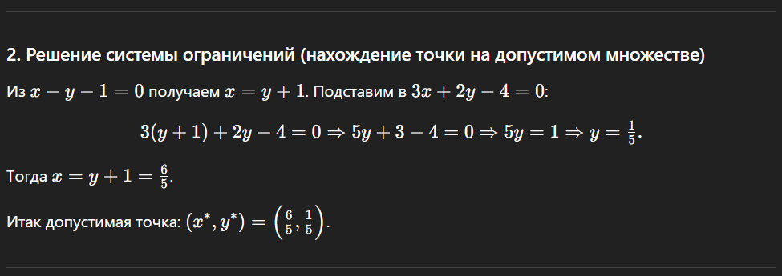
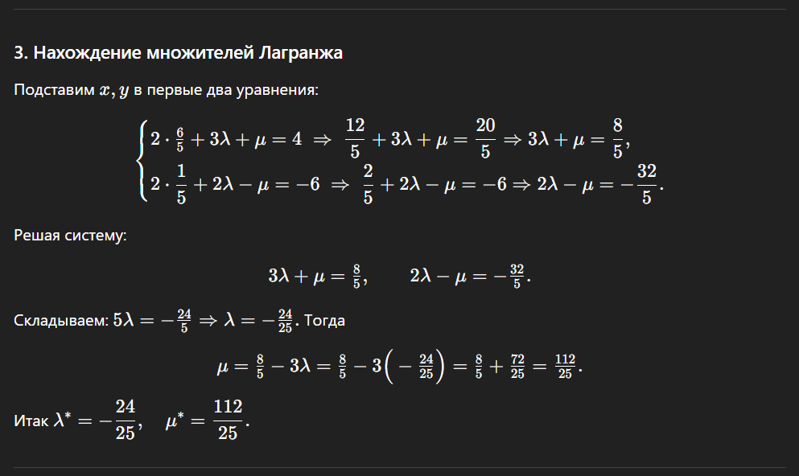
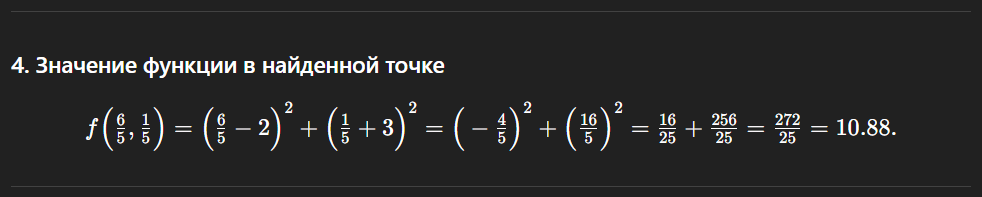
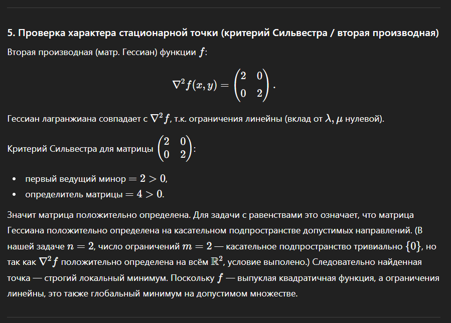
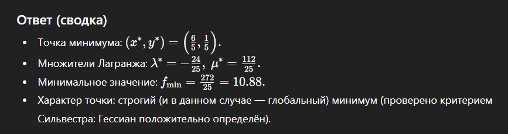

# Отчёт по практической работе №3

## Решение задачи условной выпуклой оптимизации методом множителей Лагранжа

**Выполнил:** Христофоров Владислав Николаевич,

**Поток**: МЕТОПТ 1.2

**Вариант задания:** 7

## 1. Условие задачи

**Дано:**  
Минимизировать $f(x,y)=(x-2)^2+(y+3)^2$ при

$$

g_1(x,y)=3x+2y-4=0,\quad g_2(x,y)=x- y-1=0.

$$

## 2. Ответ, сгенерированный большой языковой моделью (БЯМ) с комментариями

Ответ БЯМ разбит на логические блоки. К каждому блоку добавлен комментарий о корректности действий модели.

### **2.1. Постановка Лагранжиана**

**Комментарий:**  
Действие БЯМ выполнено верно. Функция Лагранжа составлена корректно для задачи с двумя ограничениями-равенствами, введены соответствующие множители Лагранжа $\lambda$ и $\mu$. Система уравнений для нахождения стационарных точек выписана правильно.

### **2.2. Решение системы ограничений**

**Комментарий:**  
БЯМ правильно начинает с решения системы ограничений. Решение системы линейных уравнений выполнено без ошибок, точка $(1.2, 0.2)$ найдена верно.

### **2.3. Нахождение множителей Лагранжа**

**Комментарий:**  
Расчёт множителей Лагранжа выполнен верно. Модель корректно подставила найденные $x^*$ и $y^*$ в уравнения и решила получившуюся линейную систему. Арифметических ошибок нет.

### **2.4. Значение функции в найденной точке**

**Комментарий:**  
Вычисление значения целевой функции в стационарной точке выполнено верно. Результат $\frac{272}{25}$ (или 10.88) корректен.

### **2.5. Проверка характера точки (критерий Сильвестра)**

**Комментарий:**  
БЯМ верно вычислила гессиан целевой функции $f$ – это постоянная положительно определённая матрица. Согласно критерию Сильвестра, если матрица Гессиана функции Лагранжа положительно определена, то найденная стационарная точка является точкой минимума. В данном случае матрица действительно положительно определена (главные миноры положительны), значит, БЯМ делает правильный вывод о том, что это строгий локальный минимум. Также верно отмечено, что из-за выпуклости функции и линейности ограничений этот минимум является глобальным на заданном множестве.

### **2.6. Ответ**

## 3. Рефлективное заключение

Большая языковая модель успешно справилась с решением задачи условной оптимизации методом множителей Лагранжа. Можно отметить следующие сильные стороны её работы:

1. **Строгое следование алгоритму:** Модель корректно сформировала функцию Лагранжа, выписала необходимые условия первого порядка и последовательно их решила.
2. **Точность вычислений:** Все алгебраические преобразования и арифметические расчёты были выполнены без ошибок.
3. **Анализ второго порядка:** Модель применила критерий Сильвестра для проверки знакоопределённости матрицы Гессиана и на его основе сделала верный вывод о характере экстремума.

В данном задании БЯМ продемонстрировала полное понимание стандартной схемы решения задачи на условный экстремум методом множителей Лагранжа, включая проверку достаточных условий с помощью критерия Сильвестра. Все шаги решения логичны и математически корректны.
