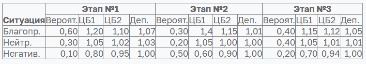
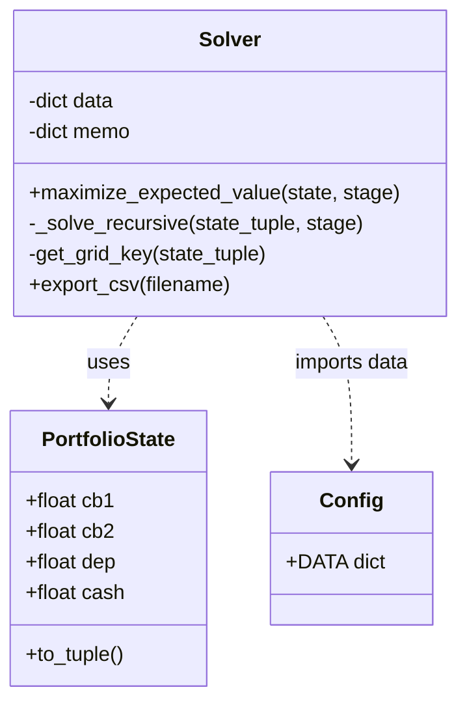
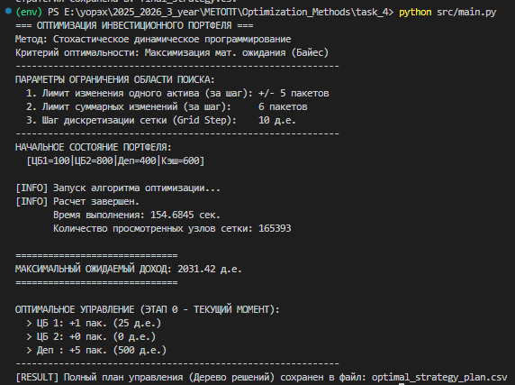
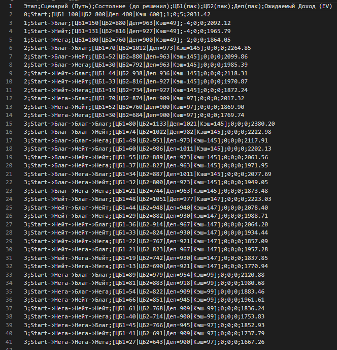

# Отчёт по практической работе №4

## Решение задачи динамического программирования

**Выполнил:** Христофоров Владислав Николаевич,

**Поток**: МЕТОПТ 1.2

### 1. Цель работы и постановка задачи

---

**Цель работы:** Разработать математическую модель и программный алгоритм для нахождения оптимальной стратегии управления инвестиционным портфелем в условиях неопределенности (стохастичности) рынка.

**Постановка задачи:**
Инвестор управляет портфелем, состоящим из двух видов ценных бумаг (ЦБ1, ЦБ2), депозита и свободных денежных средств.

-   **Начальные условия:** ЦБ1=100, ЦБ2=800, Деп=400, Кэш=600.

-   **Период планирования:** 3 этапа.

-   **Управление:** Дискретное, пакетами по 25% от начальной стоимости актива (ЦБ1=25, ЦБ2=200, Деп=100).

-   **Ограничения:** 1. Нельзя брать кредит (свободные средства $\ge 0$). 2. Неснижаемые остатки: ЦБ1 $\ge 30$, ЦБ2 $\ge 150$, Деп $\ge 100$.

-   **Стохастика:** Доходность зависит от случайного состояния рынка (Благоприятное, Нейтральное, Негативное). Вероятности и мультипликаторы заданы в таблиц:

    

-   **Критерий:** Максимизация математического ожидания итогового капитала (Критерий Байеса).

### 2. Общая математическая формулировка задачи ДП

---

Задача относится к классу задач стохастического динамического программирования с конечным горизонтом планирования.

#### Переменные состояния

Состояние системы на этапе $k$ ($k = 0, 1, 2$) описывается вектором $S_k$:

$$
S_k = (V_{CB1}, V_{CB2}, V_{Dep}, V_{Cash})
$$

#### Управление

Вектор управления $u_k = (\Delta_1, \Delta_2, \Delta_3)$, где $\Delta_i \in \mathbb{Z}$ – количество покупаемых ($\Delta > 0$) или продаваемых ($\Delta < 0$) пакетов.

#### Функция перехода

Процесс перехода $S_k \to S_{k+1}$ состоит из двух фаз:

1. **Детерминированная (Принятие решения):**

$$
S'_k = S_k + u_k \cdot P - \text{Comm}(u_k)
$$

где $P$ – стоимость пакетов, $\text{Comm}$ – комиссия брокера.

2. **Стохастическая (Рынок):**

$$
S_{k+1} = S'_k \cdot M(\omega)
$$

где $M(\omega)$ – матрица мультипликаторов доходности для выпавшего случайного события $\omega$.

### 3. Рекуррентное соотношение Беллмана

---

Пусть $J_k(S)$ – функция максимального ожидаемого дохода от текущего момента $k$ до конца периода планирования, при условии нахождения системы в состоянии $S$.

**Основное уравнение:**

$$
J_k(S) = \max_{u \in U_{adm}(S)} \left\lbrace \sum_{j=1}^{3} p_{k,j} \cdot J_{k+1}\Big( T(S, u, \omega_j) \Big) \right\rbrace
$$

Где:

-   $U_{adm}(S)$ – множество допустимых управлений (с учетом бюджета и лимитов).

-   $p_{k,j}$ – вероятность $j$-го сценария на этапе $k$.

-   $T(S, u, \omega_j)$ – функция перехода состояния.

**Граничное условие (Терминальное состояние,** $k=3$**):**

$$
J_3(S) = V_{CB1} + V_{CB2} + V_{Dep} + V_{Cash}
$$

#### Описание метода прохождения:

-   **Обратный проход (Backward Induction):** Используется для нахождения оптимальной стратегии. Расчет начинается с последнего этапа (где ценность состояния известна) и идет к началу. Для каждого состояния на этапе $k$ выбирается управление, максимизирующее ожидаемый результат на этапе $k+1$.

-   **Прямой проход (Forward Pass):** Используется для имитации или реального выполнения плана. Находясь в текущем состоянии, мы применяем найденное оптимальное управление, затем "случается" событие рынка, и мы переходим в новое состояние.

### 4. Алгоритм и Программная реализация

---

#### Псевдокод основного алгоритма

```

Function MaximizeExpectedValue(State s, Stage k):
1.  База рекурсии:
    Если k > 3: Вернуть Сумма(s.Assets + s.Cash)

2.  Мемоизация (Кэширование):
    Ключ = Дискретизация(s) // Округление до сетки
    Если Ключ в Кэше: Вернуть Кэш[Ключ]

3.  Генерация управлений:
    Сформировать список допустимых действий Actions
    (с учетом бюджета, лимитов и шага управления)

4.  Поиск максимума:
    BestEV = -Бесконечность
    Для каждого действия u из Actions:
        a. Применить управление: NewState = Apply(s, u)
        b. Если NewState недопустим: Пропустить
        c. Считаем EV:
            CurrentEV = 0
            Для каждого сценария w (Prob, Mult):
                NextState = NewState * Mult
                FutureVal = MaximizeExpectedValue(NextState, k + 1)
                CurrentEV += FutureVal * Prob

        d. Обновить BestEV, если CurrentEV больше

5.  Сохранить BestEV в Кэш
6.  Вернуть BestEV

```

#### Диаграмма классов



### 5. Демонстрационные примеры

---

Программа была запущена с параметрами ограничения области поиска (для оптимизации скорости).

Результат работы выполнения программы:



Полученный план управления:




### 6. Заключение
---

В результате выполнения лабораторной работы решена задача оптимизации управления инвестиционным портфелем в условиях стохастической неопределенности. Построена математическая модель на основе уравнения Беллмана и реализована программно на языке Python.

Ключевым этапом работы стало преодоление проблемы размерности пространства состояний, характерной для финансовых задач с непрерывными величинами. Для этого был применен метод сеток, что позволило свести бесконечное множество состояний к конечному числу узлов и применить эффективное кэширование результатов.

Полученная оптимальная стратегия демонстрирует экономическую целесообразность: алгоритм корректно учитывает транзакционные издержки и на финальных этапах планирования часто рекомендует воздерживаться от активных действий, если потенциальная прибыль не перекрывает комиссии брокера. 

Таким образом, работа подтвердила эффективность методов динамического программирования для принятия обоснованных инвестиционных решений.
