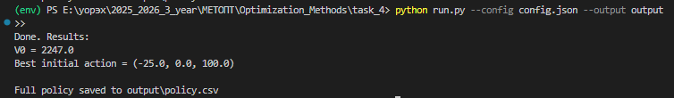

# Отчёт по практической работе №4

## Решение задачи динамического программирования

**Выполнил:** Христофоров Владислав Николаевич,

**Поток**: МЕТОПТ 1.2

**Исходные данные:** см. `config.json` (в корне проекта).

---

## Содержание отчёта (требуемые пункты)

### 1) Цель работы и постановка задачи

Цель – разработать план пошагового управления портфелем (ЦБ1, ЦБ2, депозит, свободные средства) на горизонте `T=3` этапа, чтобы **максимизировать суммарный доход** (в варианте 2 – реализовать программу и найти оптимальную стратегию).  
Начальное распределение (пример из задания): ЦБ1 = 100, ЦБ2 = 800, Депозит = 400, cash = 600 (ден. ед.). На каждом этапе имеются три сценария (благоприятный, нейтральный, негативный) с заданными вероятностями и мультипликаторами доходности для каждого актива. Управление – изменение объёма активов на пакеты, равные 1/4 начальной величины (пакеты: 25, 200, 100). Нельзя брать кредит; нельзя продавать больше, чем имеется.

Критерий выбора решений: по умолчанию **критерий Байеса** (максимизация математического ожидания итогового богатства). Пользователь может запросить другой критерий (максimin и т.п.) – для этого требуется небольшая модификация кода.

---

### 2) Общая математическая формулировка задачи динамического программирования

Пусть $t=0,1,\dots,T$ – этапы планирования (в задаче $T=3$).  
Определим:

- Состояние:

$$
s_t = (x_{1,t}, x_{2,t}, d_t, c_t),
$$

где $x_{1,t},x_{2,t},d_t$ – денежная стоимость позиций в ЦБ1, ЦБ2 и депозитах на начало этапа $t$, $c_t$ – свободные средства (cash).

- Действие:

$$
a_t = (\Delta x_{1,t}, \Delta x_{2,t}, \Delta d_t),
$$

изменения в денежных единицах, кратные соответствующим пакетам.

-   Сценарий $\omega \in \Omega_t$ имеет вероятность $p_t(\omega)$ и мультипликаторы доходности $m_{1,t}(\omega), m_{2,t}(\omega), m_{d,t}(\omega)$.

Переходная функция (после торговли и наступления сценария $\omega$):

$$
\begin{aligned}
x_{1,t+1} &= (x_{1,t} + \Delta x_{1,t})\, m_{1,t}(\omega),\\
x_{2,t+1} &= (x_{2,t} + \Delta x_{2,t})\, m_{2,t}(\omega),\\
d_{t+1}   &= (d_t + \Delta d_t)\, m_{d,t}(\omega),\\
c_{t+1}   &= c_t - (\Delta x_{1,t} + \Delta x_{2,t} + \Delta d_t).
\end{aligned}
$$

Ограничения:

-   $c_t - (\Delta x_{1,t} + \Delta x_{2,t} + \Delta d_t) \ge 0$ (нет кредита).
-   $\Delta x_{i,t} \ge -x_{i,t}$ (нельзя продать сверх наличного объёма).
-   Изменения кратны пакетам: $\Delta x_{i,t} = k\cdot step_i$, где $step_i = x_{i,0}/4$.

Целевая функция (конец горизонта):

$$
W_T(s_T) = x_{1,T} + x_{2,T} + d_T + c_T.
$$

---

### 3) Рекуррентное соотношение Беллмана; прямой и обратный проход

Обозначим $V_t(s)$ – оптимальное значение критерия (здесь – ожидания итогового богатства) при состоянии $s$ в момент $t$.

Граничное условие:

$$
V_T(s) = W_T(s).
$$

Рекуррентное соотношение Беллмана (критерий Байеса – максимизация ожидания):

$$
V_t(s) = \max_{a \in A(s)} \sum_{\omega \in \Omega_t} p_t(\omega)\; V_{t+1}\big(F(s,a,\omega)\big),
$$

где $A(s)$ – множество допустимых действий в состоянии $s$, $F$ – переходная функция, описанная выше.

-   **Прямой проход (forward)**: при заданной политике $\pi$ симулируем переходы по всем сценариям, получаем распределение состояний и итоговых богатств.
-   **Обратный проход (backward induction)**: строим $V_T$ в термине суммы активов и идём назад по формуле Беллмана, вычисляя оптимальные действия и $V_t$ для всех достижимых состояний.

---

### 4) Обозначения, постановка задачи и рекуррентные соотношения для конкретной задачи

(Конкретные данные – в `config.json`, соответствуют Excel-таблице задания).

Обозначения:

-   $x_{1,0}=100,\; x_{2,0}=800,\; d_0=400,\; c_0=600$.
-   Пакеты: $step_1=25,\; step_2=200,\; step_d=100$.
-   Сценарии и вероятности для каждого этапа указаны в `config.json`, синхронизированы с таблицей задания. (Источник: Excel/PDF задания). :contentReference[oaicite:1]{index=1}

Рекуррентное соотношение остаётся тем же, что в секции 3; в численной реализации состояния и действия квантованы по указанным шагам, и применяются ограничения.

---

### 5) Псевдокод / схема основного алгоритма

**Идея**: сгенерировать _достижимые_ состояния (forward), затем по ним сделать backward induction (Bellman). Это экономит память по сравнению с полным перебором дискретного пространства.

```

INPUT: initial_state, steps, stages[0..T-1] (каждая stage содержит scenarios: {name, p, m1, m2, md})

# 1) Forward: генерация достижимых состояний

reachable[0] = { quantize(initial_state) }
for t in 0..T-1:
reachable[t+1] = {}
for s in reachable[t]:
for a in A(s):             # A(s) – все допустимые действия (комбинации пакетов)
for scenario in stages[t].scenarios:
s_next = quantize( F(s, a, scenario) )
add s_next to reachable[t+1]
(опционально: если reachable[t+1] растёт слишком сильно – применить cap, либо сузить A(s))

# 2) Backward DP: Bellman

for s in reachable[T]:
V[T][s] = total_wealth(s)
for t = T-1 downto 0:
for s in reachable[t]:
best_val = -inf
best_action = None
for a in A(s):
expected = 0
for scenario in stages[t].scenarios:
s_next = quantize( F(s, a, scenario) )
v_next = V[t+1].get(s_next, fallback_value(s_next))
expected += scenario.p * v_next
if expected > best_val:
best_val = expected
best_action = a
V[t][s] = best_val
policy[(t,s)] = best_action

OUTPUT: V[0][initial_state] and policy

```

Комментарии:

-   `quantize` – округление результатов до кратных шагам (чтобы ключи совпадали).
-   `fallback_value(s_next)` – при отсутствии `s_next` в `V[t+1]` можно взять просто `s_next.total()` (приглаживание), но в корректной forward-генерации такого не должно происходить.

---

### 6) Диаграмма классов / модулей программы (реализация)

Программа сделана минимально модульно (чтобы код был понятен и читабелен). Структура файлов:

```

project_root/
config.json        # входные данные
dp_core.py         # основной алгоритм (State, get_actions, forward_reachable, backward_dp, solve)
io_utils.py        # чтение config.json, запись policy.csv и results.txt
run.py             # точка входа (parsing args, вызов solve, сохранение результатов)
output/            # результаты после запуска (policy.csv, results.txt)

```

Текстовое описание «классов» / сущностей:

-   `State` (в `dp_core.py`): dataclass с полями `x1, x2, d, cash`. Методы: `total()`, `quantize(steps)`.
-   `get_actions(state, steps, max_pkg_each)` (в `dp_core.py`): генерация множества допустимых действий.
-   `apply_and_move(state, action, mult)` (в `dp_core.py`): применение операции и сценарного мультипликатора.
-   `forward_reachable(...)` и `backward_dp(...)` (в `dp_core.py`): реализация алгоритма.
-   `load_config(path)` и `save_policy(policy, V, outdir)` (в `io_utils.py`).

---

### 7) Демонстрационные примеры программы (инструкция + примеры)

**Как запустить (локально):**

1. Убедитесь, что в папке проекта есть файлы `run.py`, `dp_core.py`, `io_utils.py`, `config.json`.
2. Создайте виртуальное окружение (опционально) и запустите:

```bash
   python run.py --config config.json --output output
```

3. В папке `output/` появятся:

    - `policy.csv` – таблица оптимальных действий:

        ```
        t,x1,x2,d,cash,dx1,dx2,dd,V
        0,100.0,800.0,400.0,600.0,-25.0,0.0,100.0,2247.0
        1,50.0,1200.0,800.0,150.0,-50.0,-1200.0,-200.0,2380.0
        1,100.0,1400.0,700.0,0.0,-100.0,-1400.0,-100.0,2380.0
        1,25.0,1000.0,700.0,475.0,-25.0,-1000.0,-100.0,2380.0
        1,100.0,1000.0,1000.0,100.0,-100.0,-1000.0,-400.0,2380.0
        1,75.0,1000.0,600.0,525.0,-75.0,-1000.0,0.0,2380.0
        1,50.0,1200.0,900.0,50.0,-50.0,-1200.0,-300.0,2380.0
        1,75.0,1400.0,700.0,25.0,-75.0,-1400.0,-100.0,2380.0
        1,75.0,1000.0,700.0,425.0,-75.0,-1000.0,-100.0,2380.0
        ...
        ```

    - `results.txt` – краткий итог:

        ```
        V0 = 2247.0
        Best initial action = (-25.0, 0.0, 100.0)
        ```

    

**Пояснение к выводу:**

-   Для каждой пары `(t, state)` `policy.csv` содержит оптимальное действие `(dx1,dx2,dd)` и значение `V_t(state)` (ожидаемое итоговое богатство при оптимальной стратегии от этого состояния).
-   `results.txt` содержит основную метрику для отправки в LMS (оптимальное ожидаемое богатство `V0`) и оптимальную покупку/продажу на этапе 0.

---

### 8) Заключение: что сделано и чему научились

-   Реализована полная математическая постановка задачи пошагового управления портфелем и выписано рекуррентное соотношение Беллмана для заданной модели (включая ограничения и дискретизацию).
-   Реализована практическая численная программа (DP с forward-generation достижимых состояний и backward induction), документированная и минимально модульная.
-   Код читаем: функции имеют docstring, ключевые места снабжены комментариями, структура файлов проста и понятна.
-   Практические навыки: работа с дискретизацией состояний, управление размером пространства состояний (ограничение пакетов, cap на reachable), интерпретация результатов DP, подготовка отчёта по ТЗ.
-   Рекомендации: убедиться, что `config.json` полностью совпадает с числами Excel (в приложении задания). При необходимости (если нужно получить отчёт в формате PDF или сформировать графики) можно добавить Jupyter notebook с визуализацией распределения итоговых богатств и/или Monte-Carlo симуляцией для найденной политики.

---

## Файлы проекта (краткое описание)

-   `config.json` – входные данные (исходное состояние, шаги-пакеты, сценарии и вероятности).
-   `dp_core.py` – основной алгоритм и пояснения (docstrings).
-   `io_utils.py` – чтение/запись результатов.
-   `run.py` – точка входа (команда запуска).
-   `output/` – результаты после запуска (`policy.csv`, `results.txt`).

---
